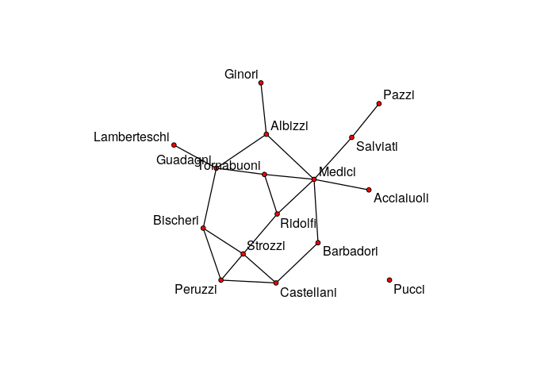
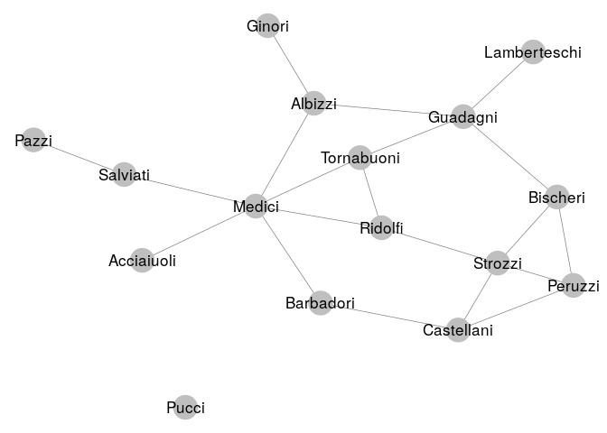
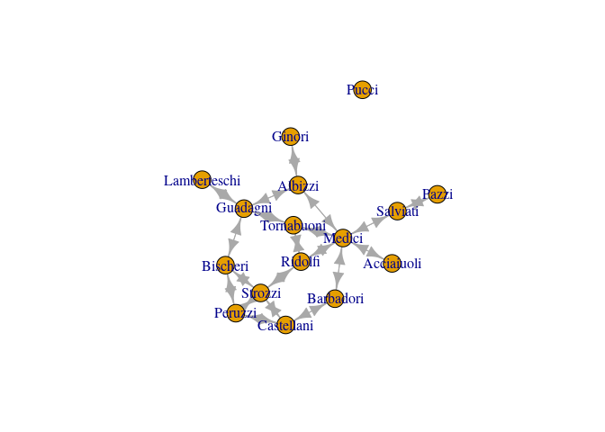

    library(networkD3)
    library(network)

    ## network: Classes for Relational Data
    ## Version 1.13.0 created on 2015-08-31.
    ## copyright (c) 2005, Carter T. Butts, University of California-Irvine
    ##                     Mark S. Handcock, University of California -- Los Angeles
    ##                     David R. Hunter, Penn State University
    ##                     Martina Morris, University of Washington
    ##                     Skye Bender-deMoll, University of Washington
    ##  For citation information, type citation("network").
    ##  Type help("network-package") to get started.

    library(sna)

    ## Loading required package: statnet.common

    ## sna: Tools for Social Network Analysis
    ## Version 2.4 created on 2016-07-23.
    ## copyright (c) 2005, Carter T. Butts, University of California-Irvine
    ##  For citation information, type citation("sna").
    ##  Type help(package="sna") to get started.

    library(igraph)

    ## 
    ## Attaching package: 'igraph'

    ## The following objects are masked from 'package:sna':
    ## 
    ##     betweenness, bonpow, closeness, components, degree,
    ##     dyad.census, evcent, hierarchy, is.connected, neighborhood,
    ##     triad.census

    ## The following objects are masked from 'package:network':
    ## 
    ##     %c%, %s%, add.edges, add.vertices, delete.edges,
    ##     delete.vertices, get.edge.attribute, get.edges,
    ##     get.vertex.attribute, is.bipartite, is.directed,
    ##     list.edge.attributes, list.vertex.attributes,
    ##     set.edge.attribute, set.vertex.attribute

    ## The following objects are masked from 'package:stats':
    ## 
    ##     decompose, spectrum

    ## The following object is masked from 'package:base':
    ## 
    ##     union

    library(ggnet)

    library(network)
    data(flo)
    net = network(flo, directed = FALSE)
    plot(net,displaylabels=TRUE,boxed.labels=FALSE)

    ggnet2(net,label=TRUE)

    ## Loading required package: scales

    g=graph_from_adjacency_matrix(flo)
    e=E(g)
    v=V(g)
    plot(g)

    df=as.data.frame(ends(g, E(g)))
    names(df)=c("src","target")
    simpleNetwork(df)

<!--html_preserve-->

<!--/html_preserve-->
